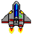
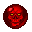

# Asteroid_JS
## Play It
To play the Game Simply clone the repository and place the Asteroids folder in the Webroot of your local server, then open your browser and on the search bar write "localhost/Asteroids". The game should start/
## Intro
My Version of the Classic Asteroid Game using Phaser 3

The Game runs on the Brower and adapts to the different screen sizes but aspect ratio of the Game Screen remains 1:1.

Controls:- 
 
The Game is played using Arrow Keys: 
Up Arrow - thrust in facing direction 
Left Arrow - rotate left 
Right Arrow - rotate right 
Back Arrow - Shoot 

The control scheme was decided as such to allow players to play with just one hand as well as hinder shooting while moving, thereby making the game somewhat more difficuult.

## Gameplay
The Game consists of a Menu, a Gameplay scene and an ending scene.

On first Play the player is required to enter their pseudonym to start playing and getting their score recorded.

There are three types of enemies:
1) Small Asteroids - Normal enemy
2) Large Asteroids - Break into two small asteroids on getting destroyed
3) Enemy Spaceship - Hits the player to reduce speed and score. 

## Powerups
There are 3 types of Powerups Available: 
1) Star : Increases Player Speed 
2) Bomb : Increases Bullet Burst Speed 
3) Rage : Enters RageMode 

## Core Gameplay

Although the project is complete, some gameplay parameters like playerspeed and enemy ship speed have not yet been tweaked to provide an optimum experience.